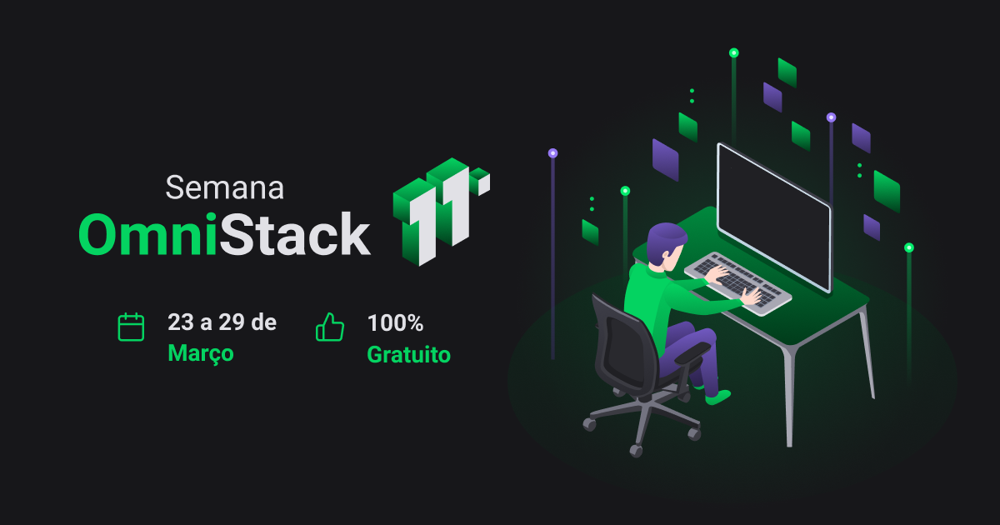
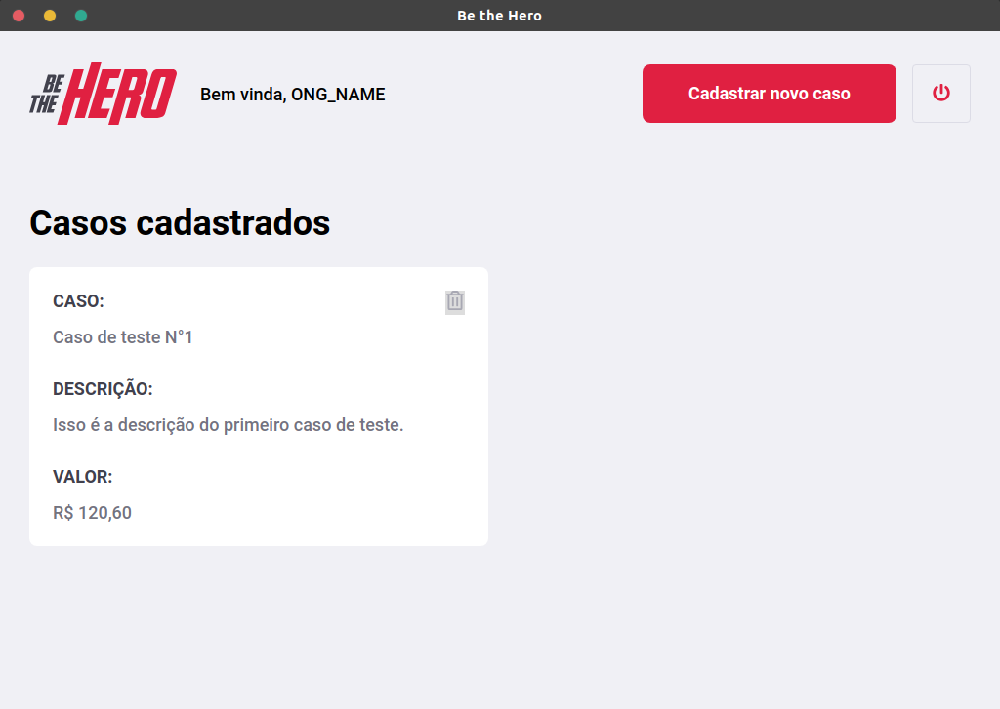
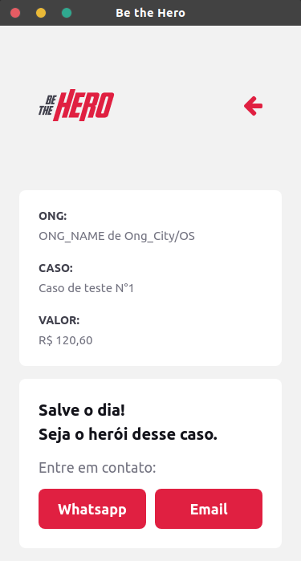

## Omnistack 11.0 Week - Be the Hero
> A full-stack system written in [NodeJS](https://nodejs.org), [ReactJS](https://reactjs.org) and [React-Native](https://reactnative.dev) that connects ONG's that need help from people willing to help. Project made during the Omnistack 11.0 Week of [Rocketseat](https://rocketseat.com.br).

  

  

  

  

  

  

### Technologies used
| Environment | Libraries |
| ------ | ------ |
| Backend | [NodeJS](https://nodejs.org), [Celebrate](https://www.npmjs.com/package/celebrate), [Cors](https://www.npmjs.com/package/cors), [Cross-Env](https://www.npmjs.com/package/cross-env), [Express](https://www.npmjs.com/package/express), [Jest](https://www.npmjs.com/package/jest), [Knex](https://www.npmjs.com/package/knex), [Nodemon](https://www.npmjs.com/package/nodemon), [SQLite3](https://www.npmjs.com/package/sqlite3), [Supertest](https://www.npmjs.com/package/supertest). |
| Frontend | [ReactJS](https://www.npmjs.com/package/react), [Axios](https://www.npmjs.com/package/axios), [Cors](https://www.npmjs.com/package/cors), [Jest-Dom](https://www.npmjs.com/package/@testing-library/jest-dom), [React-Dom](https://www.npmjs.com/package/react-dom), [React-Icons](https://www.npmjs.com/package/react-icons), [React-Router-Dom](https://www.npmjs.com/package/react-router-dom), [React-Scripts](https://www.npmjs.com/package/react-scripts), [React Testing Library](https://www.npmjs.com/package/@testing-library/react), [User-Event](https://www.npmjs.com/package/@testing-library/user-event). |
| Mobile | [Expo](https://www.npmjs.com/package/expo), [React-Native](https://www.npmjs.com/package/react-native), [ReactJS](https://www.npmjs.com/package/react), [Axios](https://www.npmjs.com/package/axios), [Babel Compiler Core](https://www.npmjs.com/package/@babel/core), [Babel-Preset-Expo](https://www.npmjs.com/package/babel-preset-expo), [Expo-Constants](https://www.npmjs.com/package/expo-constants), [Expo-Mail-Composer](https://www.npmjs.com/package/expo-mail-composer), [Intl.js](https://www.npmjs.com/package/intl), [React-Dom](https://www.npmjs.com/package/react-dom), [React Native for Web](https://www.npmjs.com/package/react-native-web), [React Native Gesture Handler](https://www.npmjs.com/package/react-native-gesture-handler), [React Native MaskedView](@react-native-community/masked-view), [React Native Navigation](https://www.npmjs.com/package/@react-navigation/native), [React Native Reanimated](https://www.npmjs.com/package/react-native-reanimated), [React-Native-Safe-Area-Context](https://www.npmjs.com/package/react-native-safe-area-context), [React Native Screens](https://www.npmjs.com/package/react-native-screens), [React Navigation Stack](https://www.npmjs.com/package/@react-navigation/stack). |

### Me
👷 Developed by Matheus Ramalho de Oliveira.  
🔨 Systems Analyst, Full-Stack Developer.  
🏡 Goiânia, Goiás, Brasil.  
✉️ kastorcode@gmail.com  
👍 [instagram.com/kastorcode](https://www.instagram.com/kastorcode)
